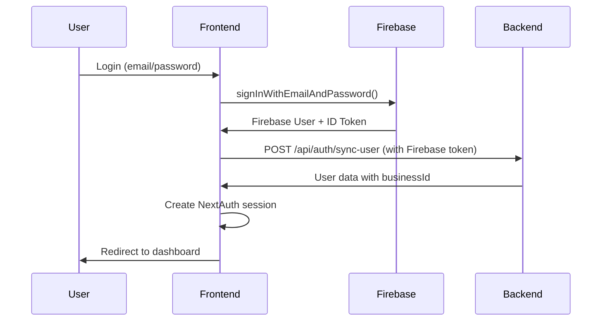
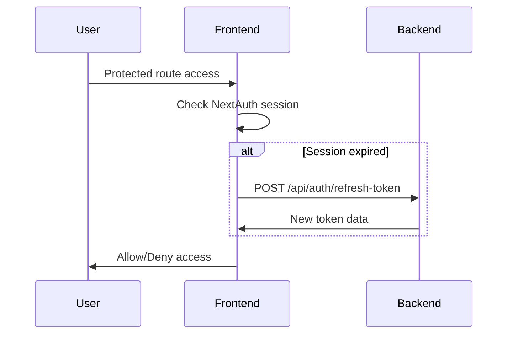

# iDEAN AI Authentication System - Backend Integration Guide

## Overview

The iDEAN AI frontend uses a hybrid authentication system combining **Firebase Authentication** with **NextAuth.js v5** for session management. This document explains how the authentication flow works, which files are involved, and how to integrate with the FastAPI backend.

## Architecture Diagram

```
┌─────────────────┐    ┌─────────────────┐    ┌─────────────────┐
│   Frontend      │    │   Firebase      │    │   FastAPI       │
│   NextAuth.js   │◄──►│   Auth          │◄──►│   Backend       │
└─────────────────┘    └─────────────────┘    └─────────────────┘
```

## Authentication Flow

### 1. User Login Process



### 2. Session Management



## File Structure & Responsibilities

### Core Authentication Files

#### 1. `/src/lib/auth/config.ts`
**Primary authentication configuration file**

```typescript
// Main NextAuth configuration
export const authConfig: NextAuthConfig = {
  providers: [
    GoogleProvider({...}),
    CredentialsProvider({...})
  ],
  callbacks: {
    jwt: {...},      // Token handling
    session: {...}   // Session creation
  }
}
```

**Key Functions:**
- `syncUserWithBackend()` - Syncs Firebase user with backend
- `getUserDataFromBackend()` - Fetches user data from API
- Handles both test users (development) and Firebase users

#### 2. `/src/lib/firebase/client.ts`
**Firebase client configuration**

```typescript
export const firebaseConfig = {
  apiKey: process.env.NEXT_PUBLIC_FIREBASE_API_KEY,
  authDomain: process.env.NEXT_PUBLIC_FIREBASE_AUTH_DOMAIN,
  // ... other config
}

export const auth = getAuth(app)
export const firestore = getFirestore(app)
```

#### 3. `/src/lib/firebase/admin.ts`
**Firebase Admin SDK (for server-side operations)**

```typescript
export const adminAuth = getAuth(adminApp)
export const adminFirestore = getFirestore(adminApp)
```

#### 4. `/src/lib/test-users.ts`
**Test user management for development**

Contains mock users and API interface:
```typescript
export const BackendAPI = {
  baseUrl: process.env.NEXT_PUBLIC_API_URL || 'http://localhost:8000',
  
  async login(email: string, password: string) {...},
  async syncUser(firebaseUser: any, firebaseToken: string) {...},
  async getUserProfile(userId: string) {...},
  async updateUserProfile(userId: string, updates: any) {...}
}
```

#### 5. `/src/middleware.ts`
**Route protection and role-based access**

```typescript
export default auth((req) => {
  const { pathname } = req.nextUrl
  const token = req.auth

  // Role-based access control
  const userRole = token?.user?.role
  
  // Business setup validation
  if (!token.user?.businessId && pathname !== '/dashboard/onboarding') {
    return NextResponse.redirect(new URL('/dashboard/onboarding', req.url))
  }
})
```

### UI Components

#### 6. `/src/components/auth/LoginForm.tsx`
**Login form component**
- Handles email/password input
- Supports URL pre-filling for test users
- Calls `signIn()` from NextAuth

#### 7. `/src/components/auth/ProtectedRoute.tsx`
**Route protection wrapper**
```typescript
export function ProtectedRoute({ 
  children, 
  requiredRoles = ['user'] 
}) {
  const { data: session } = useSession()
  // Access control logic
}
```

#### 8. `/src/components/providers/SessionProvider.tsx`
**NextAuth session provider wrapper**

## Backend API Integration

### Required Environment Variables

```env
# Frontend (.env)
NEXT_PUBLIC_API_URL=http://localhost:8000
NEXTAUTH_SECRET=your-secret-key
NEXTAUTH_URL=http://localhost:3000

# Firebase
NEXT_PUBLIC_FIREBASE_API_KEY=...
NEXT_PUBLIC_FIREBASE_AUTH_DOMAIN=...
NEXT_PUBLIC_FIREBASE_PROJECT_ID=...

# Firebase Admin (for server-side)
FIREBASE_ADMIN_PROJECT_ID=...
FIREBASE_ADMIN_CLIENT_EMAIL=...
FIREBASE_ADMIN_PRIVATE_KEY=...

# Google OAuth
GOOGLE_CLIENT_ID=...
GOOGLE_CLIENT_SECRET=...
```

### API Endpoints to Implement

#### 1. User Synchronization
```http
POST /api/auth/sync-user
Content-Type: application/json
Authorization: Bearer <firebase_id_token>

{
  "email": "user@example.com",
  "name": "John Doe",
  "role": "user",
  "firebaseUid": "firebase_user_id",
  "photoURL": "https://...",
  "provider": "email"
}
```

**Response:**
```json
{
  "user": {
    "id": "user_123",
    "email": "user@example.com",
    "name": "John Doe",
    "role": "user",
    "businessId": "business_456",
    "modules": ["iMarketing"],
    "tier": "basic",
    "onboardingCompleted": true
  }
}
```

#### 2. Token Refresh
```http
POST /api/auth/refresh-token
Authorization: Bearer <current_token>

{
  "firebaseUid": "firebase_user_id"
}
```

#### 3. User Profile Management
```http
GET /api/users/{user_id}
Authorization: Bearer <firebase_token>
```

```http
PUT /api/users/{user_id}
Authorization: Bearer <firebase_token>

{
  "businessName": "Tech Startup",
  "industry": "Technology",
  "onboardingCompleted": true
}
```

### Backend Implementation Guide

#### 1. Firebase Token Verification

```python
# Python/FastAPI example
from firebase_admin import auth

async def verify_firebase_token(id_token: str):
    try:
        decoded_token = auth.verify_id_token(id_token)
        return decoded_token
    except Exception as e:
        raise HTTPException(status_code=401, detail="Invalid token")
```

#### 2. User Sync Logic

```python
@app.post("/api/auth/sync-user")
async def sync_user(request: SyncUserRequest, current_user=Depends(verify_firebase_token)):
    # Check if user exists in database
    user = await get_user_by_firebase_uid(current_user["uid"])
    
    if not user:
        # Create new user
        user = await create_user({
            "firebase_uid": current_user["uid"],
            "email": request.email,
            "name": request.name,
            "role": "user"
        })
    
    # Update user data
    user = await update_user(user.id, request.dict())
    
    return {"user": user}
```

#### 3. Database Schema

```sql
-- Users table
CREATE TABLE users (
    id UUID PRIMARY KEY DEFAULT gen_random_uuid(),
    firebase_uid VARCHAR(255) UNIQUE NOT NULL,
    email VARCHAR(255) UNIQUE NOT NULL,
    name VARCHAR(255) NOT NULL,
    role VARCHAR(50) DEFAULT 'user',
    business_id UUID REFERENCES businesses(id),
    modules TEXT[], -- ['iMarketing', 'GrowthX', 'iMBA']
    tier VARCHAR(50) DEFAULT 'free', -- 'free', 'basic', 'pro'
    onboarding_completed BOOLEAN DEFAULT FALSE,
    photo_url TEXT,
    created_at TIMESTAMP DEFAULT NOW(),
    updated_at TIMESTAMP DEFAULT NOW()
);

-- Businesses table
CREATE TABLE businesses (
    id UUID PRIMARY KEY DEFAULT gen_random_uuid(),
    name VARCHAR(255) NOT NULL,
    industry VARCHAR(255),
    website TEXT,
    description TEXT,
    created_by UUID REFERENCES users(id),
    created_at TIMESTAMP DEFAULT NOW()
);
```

### Authentication States

#### 1. User Roles
- `user` - Regular user access
- `admin` - Admin panel access + user management
- `owner` - Full system access

#### 2. User Tiers
- `free` - Limited access (7 days trial)
- `basic` - Standard features (₹2,000/month)
- `pro` - All features + team workspace (₹5,000/month)

#### 3. Module Access
- `iMarketing` - Customer Value Journey, Nuclear Content™
- `GrowthX` - Growth Heist™, Niche Fortune™
- `iMBA` - Blue Ocean Strategy, Category Design

### Testing

#### Test Users
The system includes 3 test users for development:

```typescript
const TEST_USERS = [
  {
    email: "john@entrepreneur.com",
    password: "password123",
    role: "user",
    modules: ["iMarketing"],
    tier: "basic"
  },
  {
    email: "sarah@marketing.com", 
    password: "password123",
    role: "user",
    modules: ["iMarketing", "GrowthX"],
    tier: "pro"
  },
  {
    email: "admin@idean.ai",
    password: "admin123", 
    role: "admin",
    modules: ["iMarketing", "GrowthX", "iMBA"],
    tier: "pro"
  }
]
```

### Security Considerations

1. **Token Security**
   - Firebase tokens expire in 1 hour
   - Refresh tokens handled automatically
   - All API calls include Firebase ID token

2. **Role-Based Access**
   - Middleware validates user roles
   - Backend must verify businessId for onboarding completion
   - Module access controls content visibility

3. **Session Management**
   - NextAuth handles session encryption
   - Session data includes user role and businessId
   - Automatic session refresh on token expiry

### Migration from Test to Production

1. **Remove Test Users**
   - Update `BackendAPI.login()` to only call FastAPI
   - Remove hardcoded TEST_USERS array
   - Update authentication flow

2. **Enable Middleware Checks**
   - Uncomment businessId validation in middleware
   - Enable module-based access control

3. **Production Environment**
   - Update `NEXT_PUBLIC_API_URL` to production backend
   - Configure proper Firebase Admin credentials
   - Set up proper CORS policies

## API Call Examples

### Frontend Implementation

```typescript
// Login flow
const result = await signIn('credentials', {
  email: 'user@example.com',
  password: 'password123',
  redirect: false
})

// Get current session
const session = await getSession()

// API calls with authentication
const response = await fetch('/api/protected-endpoint', {
  headers: {
    'Authorization': `Bearer ${session.user.firebaseToken}`
  }
})
```

### Backend Integration

```python
# FastAPI dependency for authentication
async def get_current_user(token: str = Depends(oauth2_scheme)):
    decoded_token = await verify_firebase_token(token)
    user = await get_user_by_firebase_uid(decoded_token["uid"])
    return user

# Protected endpoint example
@app.get("/api/protected-data")
async def get_protected_data(current_user: User = Depends(get_current_user)):
    return {"data": "protected", "user": current_user.email}
```

This authentication system provides secure, scalable user management with role-based access control and seamless integration between Firebase, NextAuth, and your FastAPI backend.